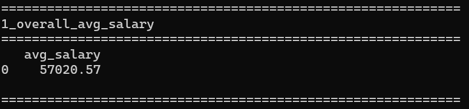
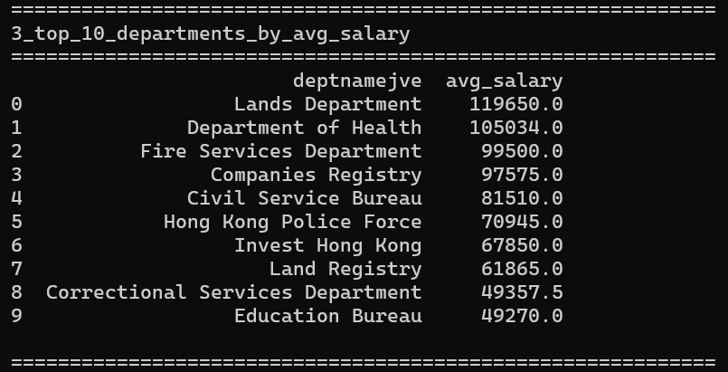
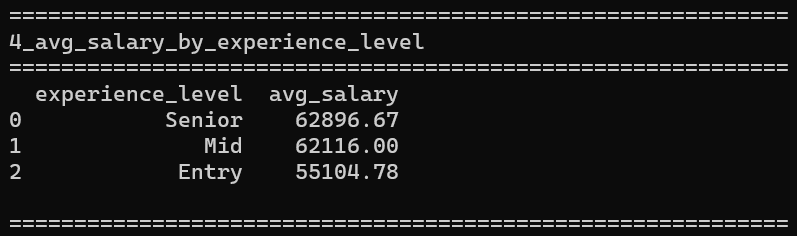
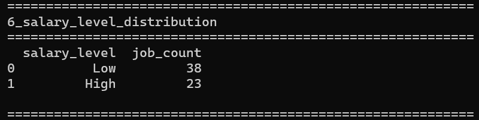
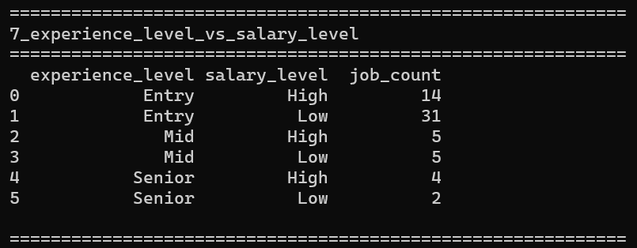

# HK Government Job Market Analysis

## Project Overview

This project analyzes real Hong Kong government job vacancy data to uncover salary patterns, department trends, and the impact of experience on compensation.

It demonstrates an end-to-end data workflow including data collection, cleaning, SQL analysis, and visualization.

---

## Summary

- Average salary: HKD 57,020  
- Salary range: HKD 11,500 – HKD 137,085  
- Highest paying departments: Lands Department, Department of Health, Fire Services Department  
- Salary increases with experience, with the largest jump from Entry to Mid level  

---

## Tools & Technologies

- Python (Requests, Pandas)
- SQL (SQLite)
- Excel (Data Visualization)
- GitHub (Project Presentation)

---

## Data Source

- Source: Hong Kong Government Open Data  
- URL: https://www.csb.gov.hk/datagovhk/gov-vacancies/

Raw JSON data is not included due to file size limitations.  
The dataset can be reproduced using the provided Python script.

---

## Data Dictionary

- jobname: Job title  
- deptnamejve: Department name  
- entrypay: Raw salary description  
- salary: Extracted numeric salary (HKD)  
- expfrom: Minimum years of experience  
- experience_level: Entry / Mid / Senior  
- salary_level: High (>=60000) / Low (<60000)  

---

## Key Insights

### Salary Overview

- Average monthly salary: HKD 57,020  
- Salary range: HKD 11,500 – HKD 137,085

  

---

### Top Paying Departments

- Lands Department (~HKD 119K)  
- Department of Health (~HKD 105K)  
- Fire Services Department (~HKD 99K)

---

### Salary vs Experience

- Salary increases with experience  
- Largest increase from Entry to Mid level

---

## Visualizations

### Top 10 Departments by Salary

Top 10 Departments

High-paying roles are concentrated in technical and specialized departments.

---

### Salary Distribution

Salary Distribution

Most job opportunities are concentrated in the mid-salary range.

---

### Salary by Experience

Salary by Experience

Salary growth is strongest from Entry to Mid level.

---

### High vs Low Salary by Experience

Salary Level

Higher experience levels are associated with a greater proportion of high-paying roles.

---

## SQL Analysis

These SQL queries are used to validate and support the insights shown in the visualizations.

Example:

SELECT experience_level, AVG(salary)
FROM gov_jobs
GROUP BY experience_level;

Full queries available in:

sql/analysis.sql

---

## Business Value

This analysis helps identify:

- Which departments offer higher salary potential  
- How experience affects earning potential  
- Where most job opportunities are concentrated  

---

## How to Reproduce

pip install -r requirements.txt  
python scripts/fetch_data.py  
python scripts/sql_analysis.py  

---

## Author

Freda Choy
